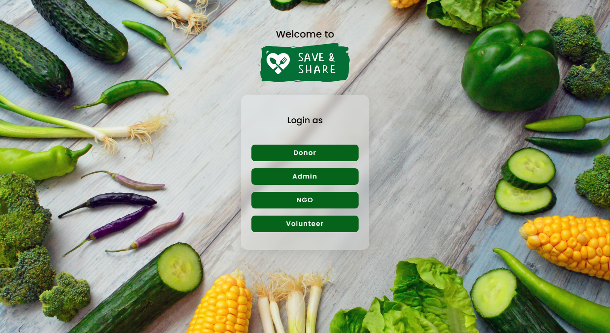

# TIC TECH TOE 2k24
# Save & Share 🍱 -By Mindfresh Team

Our idea involves addressing two critical issues: food insecurity and food waste. The goal is to build a digital platform that connects food donors (e.g., restaurants, grocery stores, individuals with surplus food) with NGOs (who help distribute the food) and volunteers (who assist with logistics). This platform will ensure that excess food is efficiently  redistributed to those in need, thus minimizing waste and providing nourishment to underserved communities.
## Table of Contents

- [Overview](#overview)
- [Features](#features)
- [Upcoming Features](#upcoming-features)
- [Screenshots](#screenshots)
- [Usage](#usage)
- [License](#license)

## Overview

We bring in the solution by building “Save & Share”: Ideation Document: Tackling Food Insecurity and Waste through a Seamless Food 
 Redistribution Platform

## Features

User Module Features

- User Registration and Login:
Secure signup and login process with email verification.
Password recovery options.

- Donation Process:
Form to enter food details (type, quantity, expiry date).
Ability to upload photos of the food (optional).

- Matching Donations:
Automated system to match donations with nearby NGOs or individuals.

- Donation History:
View past donations, including details and impact metrics.
Option to edit or cancel upcoming donations.

- Admin Module Features
Admin Dashboard:
Overview of total donations, active NGOs, and current requests.

- Donation Management:
View, approve, or reject donations.
Filter donations by type, quantity, or location.

## Upcoming Features

- Chatbot Support:
Integrated chatbot for FAQs and guidance through the donation process.

- Notifications:
Email/SMS alerts for donation confirmation and pickup schedules.

- Rating and Feedback System:
NGOs can rate delivery personnel based on their service quality.

## Screenshots

### Welcome Page

### Login Screen

### After Signup Screen

### Main Dashboard

## Usage

This project is worth choosing because it tackles two major issues: food waste and 
food insecurity. By building a platform that connects food donors with NGOs and 
volunteers, we can help redistribute surplus food efficiently, ensuring that less food goes to 
waste while more people in need get nourished. It’s a meaningful project with real-world 
impact, leveraging technology to make a difference in communities

## License

This project is licensed under the MIT License. See the [LICENSE](LICENSE) file for details.
